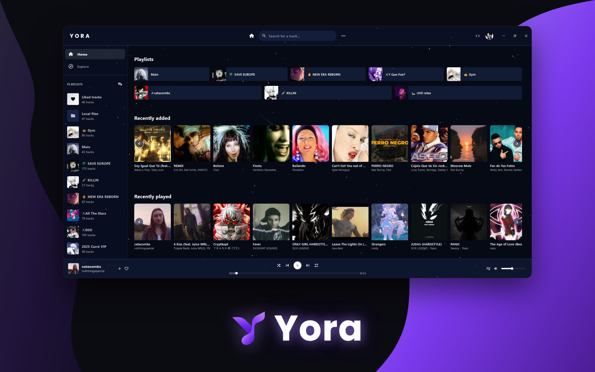

  

# Yora

A cross-platform music player that brings your local library and online music together in one place. 
Search, stream, download and organize your music. No account, no ads, no server: everything stays on your device.

---

## 🌃 Features

- 🎵 **One library for everything**: your local files and online tracks side by side, in the same playlists
- 🔎 **Online search with instant preview**: listen before you add a track to your library
- ⬇️ **Downloads in MP3** with title, artist, album and cover art embedded
- 📥 **Playlist import** from a link, in a few seconds
- 🧭 **Explore**: genres, Top 100 by country, new releases and full artist pages with their discography
- 🔀 **Full playback control**: drag-and-drop queue, shuffle, repeat, crossfade, resume where you left off
- ↩️ **Playlist editing** with undo/redo, drag-and-drop, copy/paste and multi-selection
- 🎨 **Themes**: Light, Ash, Dark, Onyx, animated Aurora and Astral, or your own color and background image
- 🖥️ **Built for desktop**: tray icon, media keys, launch at startup, zoom, Discord Rich Presence
- 📱 **Built for mobile**: a dedicated touch interface, lock-screen controls and background playback
- 💾 **Backup and restore** your whole library in a single file
- ✋ **Private by design**: no account, no telemetry, no data collection
- 🌐 English and French

## 📜 ⬇️ Installation guide

<table>
  <tr>
    <th>Platform</th>
    <th>Package/Installation Method</th>
  </tr>
  <tr>
    <td>Windows</td>
    <td>
      
    </td>
  </tr>
  <tr>
    <td>Android</td>
    <td>
      
    </td>
  </tr>
  <tr>
    <td>macOS</td>
    <td>
      
    </td>
  </tr>
  <tr>
    <td>Linux</td>
    <td>
      
      
Then run: <code>tar -xzf yora-linux-x64.tar.gz && cd yora && ./install.sh</code>

    </td>
  </tr>
  <tr>
    <td>iOS</td>
    <td>
      
      <blockquote>
        *iPA file only. Requires sideloading with <a href="https://altstore.io/">AltStore</a> or similar tools.
      </blockquote>
    </td>
  </tr>
</table>

Everything Yora needs is bundled with the app: there is nothing else to install.

> The macOS, Linux and iOS versions are still experimental. If something goes wrong, please [open an issue](https://github.com/Challenge-4/Yora/issues).

## 💼 License

Yora is free and open source software, licensed under the [GNU General Public License v3.0](LICENSE). Any copy or modified version must stay open source under the same license, with its full source code published.

The Yora name and logo are not covered by this license (GPL-3.0, section 7e): any modified version must use a different name and logo.

  

    <h2><code>[Click to show]</code> 🙏 Credits</h2>
  

### Tools

1. [yt-dlp](https://github.com/yt-dlp/yt-dlp) - A feature-rich command-line audio/video downloader, used for search and downloads.
1. [FFmpeg](https://ffmpeg.org) - A complete, cross-platform solution to record, convert and stream audio and video, used for audio conversion and tagging.
1. [youtubedl-android](https://github.com/JunkFood02/youtubedl-android) - yt-dlp and FFmpeg for Android, used by the Android version.
1. [Flutter](https://flutter.dev) - Google's UI toolkit for building natively compiled applications for mobile, web and desktop from a single codebase.

### Dependencies

1. [audio_service](https://github.com/ryanheise/audio_service) - Flutter plugin to play audio in the background while the screen is off.
1. [audio_service_mpris](https://github.com/bdrazhzhov/audio-service-mpris) - audio_service platform interface supporting Media Player Remote Interfacing Specification.
1. [audio_session](https://github.com/ryanheise/audio_session) - Sets the iOS audio session category and Android audio attributes for your app, and manages your app's audio focus, mixing and ducking behaviour.
1. [connectivity_plus](https://github.com/fluttercommunity/plus_plugins/tree/main/packages/connectivity_plus/connectivity_plus) - Flutter plugin for discovering the state of the network (WiFi & mobile/cellular) connectivity on Android and iOS.
1. [cross_file](https://github.com/flutter/packages/tree/main/packages/cross_file) - An abstraction to allow working with files across multiple platforms.
1. [cupertino_icons](https://github.com/flutter/packages/tree/main/third_party/packages/cupertino_icons) - Default icons asset for Cupertino widgets based on Apple styled icons.
1. [dart_discord_presence](https://github.com/edde746/dart_discord_presence) - Discord Rich Presence for Dart/Flutter desktop applications.
1. [desktop_drop](https://github.com/MixinNetwork/flutter-plugins/tree/main/packages/desktop_drop) - A plugin which allows user dragging files to your flutter desktop applications.
1. [file_picker](https://github.com/miguelpruivo/flutter_file_picker) - A package that allows you to use a native file explorer to pick single or multiple absolute file paths, with extension filtering support.
1. [flutter_localizations](https://api.flutter.dev/flutter/flutter_localizations/flutter_localizations-library.html) - Localizations for the Flutter framework.
1. [hotkey_manager](https://github.com/leanflutter/hotkey_manager) - This plugin allows Flutter desktop apps to defines system/inapp wide hotkey (i.e. shortcut).
1. [http](https://github.com/dart-lang/http/tree/master/pkgs/http) - A composable, multi-platform, Future-based API for HTTP requests.
1. [image](https://github.com/brendan-duncan/image) - Dart Image Library provides server and web apps the ability to load, manipulate, and save images with various image file formats.
1. [intl](https://github.com/dart-lang/i18n/tree/main/pkgs/intl) - Contains code to deal with internationalized/localized messages, date and number formatting and parsing, bi-directional text, and other internationalization issues.
1. [launch_at_startup](https://github.com/leanflutter/launch_at_startup) - This plugin allows Flutter desktop apps to Auto launch on startup / login.
1. [media_kit](https://github.com/media-kit/media-kit) - A cross-platform video player & audio player for Flutter & Dart. Performant, stable, feature-proof & modular.
1. [media_kit_libs_video](https://github.com/media-kit/media-kit) - package:media_kit video (& audio) playback native libraries for all platforms.
1. [path_provider](https://github.com/flutter/packages/tree/main/packages/path_provider/path_provider) - Flutter plugin for getting commonly used locations on host platform file systems, such as the temp and app data directories.
1. [screen_retriever](https://github.com/leanflutter/screen_retriever) - This plugin allows Flutter desktop apps to Retrieve information about screen size, displays, cursor position, etc.
1. [shared_preferences](https://github.com/flutter/packages/tree/main/packages/shared_preferences/shared_preferences) - Flutter plugin for reading and writing simple key-value pairs. Wraps NSUserDefaults on iOS and SharedPreferences on Android.
1. [tray_manager](https://github.com/leanflutter/tray_manager) - This plugin allows Flutter desktop apps to defines system tray.
1. [window_manager](https://github.com/leanflutter/window_manager) - This plugin allows Flutter desktop apps to resizing and repositioning the window.
1. [windows_taskbar](https://github.com/alexmercerind/windows_taskbar) - Flutter plugin serving utilities related to Windows taskbar.
1. [youtube_explode_dart](https://github.com/Hexer10/youtube_explode_dart) - A port in dart of the youtube explode library, used by the iOS version.

Yora is not affiliated with YouTube, Spotify, Deezer or Discord.

<h4>© Copyright Yora 2026</h4>

